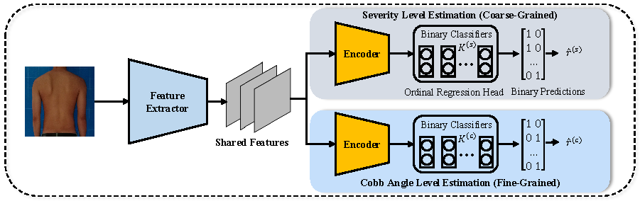

# MGScoliosis
MGScoliosis: Multi-Grained Scoliosis Detection with Joint Ordinal Regression from Natural Image

### Overview


### Datasets
Data prepare: The dataset should follow the ImageNet folder structure.Each image should be named like 'MT-18-35.jpg', where 18 represents the Cobb angle size.

```
│dataset/
├──train/
│  ├── 0
│  │   ├── MT-8-35.jpg
│  │   ├── L-9-36.jpg
│  │   ├── ......
│  ├── 1
│  │   ├── ......

├──val/
│  ├── 0
│  │   ├── L-6-40.jpg
│  │   ├── PT-9-41.jpg
│  │   ├── ......
│  ├── ......
```

